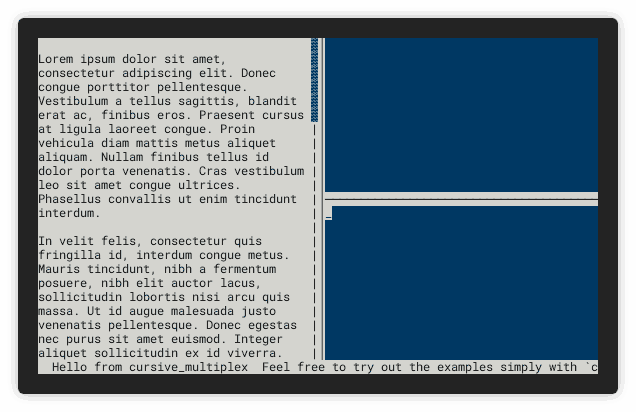

<p align="center">
  
</p>
<h1 align="center">Welcome to cursive-multiplex 👋</h1>
<p align="center">
  <a href="https://travis-ci.org/deinstapel/cursive-multiplex">
    
  </a>
  <a href="https://travis-ci.org/deinstapel/cursive-multiplex">
    
  </a>
  <a href="https://crates.io/crates/cursive-multiplex">
    
  </a>
  <a href="https://docs.rs/cursive-multiplex">
    
  </a>
  <a href="https://github.com/deinstapel/cursive-multiplex/blob/master/LICENSE">
    
  </a>
  <a href="http://spacemacs.org">
    
  </a>
  <a href="http://makeapullrequest.com">
    
  </a>
  <br>
  <i>A tmux like multiplexer for
  <a href="https://github.com/gyscos/cursive">gyscos/cursive</a>
  views</i>
</p>

---

> This project is work-in-progress

This project provides a tiling window manager for [gyscos/cursive](https://github.com/gyscos/cursive) similar to Tmux. You can place any other `cursive` view inside of a `Mux` view to display these views in complex layouts side by side. Watch the demo below to see how it looks.

## How does it look like? `demo` [](https://github.com/faressoft/terminalizer)

<details>
  <summary>Expand to view</summary>
  
</details>

## Usage

Simply add to your `Cargo.toml`

```toml
[dependencies]
cursive-multiplex = "^0.2.0"
```

And then use `Mux::new` to create a new Mux view

```rust
let (mut mux, root_node) = cursive_multiplex::Mux::new(
    cursive::views::TextView::new("Hello World!".to_string())
);
```

> Mux has defaults defined for key bindings. You can change them with the API described in the [docs](https://docs.rs/cursive-multiplex).

<details>
  <summary>Expand to see default keybindings</summary>
  
  <table>
    <tr>
      <th>Action</th>
      <th>Key</th>
    </tr>
    <tr>
      <td>Move focus up</td>
      <td><code>Alt</code> + <code>&uarr;</code></td>
    </tr>
    <tr>
      <td>Move focus right</td>
      <td><code>Alt</code> + <code>&rarr;</code></td>
    </tr>
    <tr>
      <td>Move focus down</td>
      <td><code>Alt</code> + <code>&darr;</code></td>
    </tr>
    <tr>
      <td>Move focus left</td>
      <td><code>Alt</code> + <code>&larr;</code></td>
    </tr>
    <tr>
      <td>Resize up</td>
      <td><code>Ctrl</code> + <code>&uarr;</code></td>
    </tr>
    <tr>
      <td>Resize right</td>
      <td><code>Ctrl</code> + <code>&rarr;</code></td>
    </tr>
    <tr>
      <td>Resize down</td>
      <td><code>Ctrl</code> + <code>&darr;</code></td>
    </tr>
    <tr>
      <td>Resize left</td>
      <td><code>Ctrl</code> + <code>&larr;</code></td>
    </tr>
    <tr>
      <td>Zoom</td>
      <td><code>Ctrl</code> + <code>x</code></td>
    </tr>
  </table>
</details>

###  Adding views

You can add views by giving a path or an id to an existing node e.g.

```rust
let new_node = mux.add_right_of(
    cursive::views::TextView::new("Foo"),
    root_node,
).expect("adding right panel to root failed");
```

Its also possible to add views by their path.
```rust
if let Some(sibbling) = mux.root().right().right().down().build() {
    let new_node = mux.add_above(
        cursive::views::TextView::new("Foo"),
        sibbling,
    ).expect("adding by path failed");
}
```

Returned will be a Result Ok contains the new id assigned to the view, or an error in case of failure.

### Removing Views

You can also remove views, by giving the id of the views.

```rust
mux.remove_id(new_node)?;
```

On success the id of the removed node is returned.

### Switch Views

If you want to reorder your views you can easily switch them by using

```rust
mux.switch_views(new_node, old_node)?;
```

## Troubleshooting

If you find any bugs/unexpected behaviour or you have a proposition for future changes open an issue describing the current behaviour and what you expected.

## Development [](https://travis-ci.org/deinstapel/cursive-multiplex)

### Running the tests

> The tests will no longer kill your tmux server. As the tests have moved to use cursive exclusively in combination with [insta](https://crates.io/crates/insta)

#### Running all test suites

Just run

```
$ cargo test
```

to execute all available tests.

#### Investigating failed tests

In case some test fails with your changes, you can use the `cargo-insta` tool to investigate the test case.

To install
```
$ cargo install cargo-insta
```

and to run the tests and investigate all failing tests interactively.

```
$ cargo insta review
```

Any changes between the expected and received screen will be then displayed.

#### shields.io endpoints

[shields.io](https://shields.io) endpoints are generated inside the `./target/shields` folder. They are used in this README.

## Authors

**Fin Christensen**

> [:octocat: `@fin-ger`](https://github.com/fin-ger)  
> [:elephant: `@fin_ger@weirder.earth`](https://weirder.earth/@fin_ger)  
> [:bird: `@fin_ger_github`](https://twitter.com/fin_ger_github)  

<br>

**Johannes Wünsche**

> [:octocat: `@jwuensche`](https://github.com/jwuensche)  
> [:elephant: `@fredowald@mastodon.social`](https://mastodon.social/web/accounts/843376)  
> [:bird: `@Fredowald`](https://twitter.com/fredowald)  

## Show your support

Give a :star: if this project helped you!
